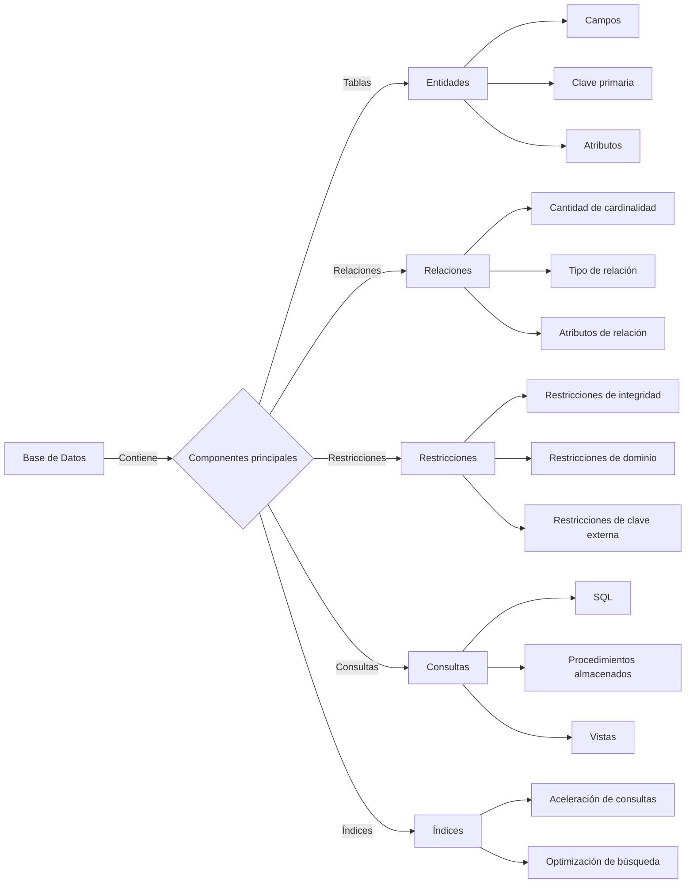

### Fundamentos de Bases de Datos ###
---
>[!tip] Objetivo de la Unidad
> Aplicar de forma coherente analítica y lógica, los conceptos de base de datos y algebra relacional.

**I.1- Objetivo Específico:** Describir, con sentido lógico, los conceptos fundamentales, metodología DBMS, arquitectura e
independencia de datos, y las características de los modelos de datos.

Un concepto de sistema es una definición que describe las características generales de un conjunto de elementos relacionados entre sí, que forman una unidad con un propósito determinado. Un sistema puede ser material o conceptual, y puede pertenecer a diferentes áreas del conocimiento, como la física, la biología o la informática.

### Define los siguientes términos: base de datos, metodología DBMS y características cde los modelos de datos ### 
- Base de datos: Una base de datos es una colección organizada y estructurada de datos que son almacenados y accedidos de manera eficiente mediante un sistema de gestión de bases de datos (DBMS). Las bases de datos permiten guardar, gestionar y recuperar información de forma rápida y segura.

- Metodología DBMS: Una metodología DBMS se refiere al conjunto de principios y técnicas utilizadas para el diseño, desarrollo, implementación y mantenimiento de un sistema de gestión de bases de datos. Estas metodologías incluyen fases como el análisis de requisitos, el diseño lógico y físico, la implementación y la administración de la base de datos.

- Características de los modelos de datos: Los modelos de datos son representaciones abstractas de una base de datos y definen la estructura, las restricciones y las operaciones que pueden ser realizadas sobre los datos. Algunas características comunes de los modelos de datos incluyen:

1. Estructura: Los modelos de datos definen la forma en que se organiza y se relaciona la información en la base de datos, como tablas, filas y columnas en el caso de los modelos relacionales.

2. Restricciones: Los modelos de datos permiten establecer reglas y restricciones para garantizar la integridad y consistencia de los datos, como restricciones de clave primaria y restricciones de integridad referencial.

3. Operaciones: Los modelos de datos definen las operaciones que pueden ser realizadas sobre los datos, como consultas, inserciones, actualizaciones y eliminaciones.

4. Abstracción: Los modelos de datos proporcionan una abstracción que permite a los usuarios y desarrolladores interactuar con la base de datos de manera más sencilla, ocultando los detalles internos de implementación.

5. Extensibilidad: Algunos modelos de datos permiten la extensibilidad, lo que significa que pueden ser personalizados y ampliados para adaptarse a necesidades específicas de la aplicación.

6. Complejidad: Los modelos de datos pueden variar en su grado de complejidad, desde modelos simples como el modelo jerárquico y el modelo de red, hasta modelos más complejos como el modelo relacional y el modelo de objetos.

### Mapa Conceptual de losprincipales componentes de la base de datos. ###

En el ==mapa conceptual== se muestra la relación entre la base de datos y sus principales componentes. Los componentes principales son las tablas, las relaciones, las restricciones, las consultas y los índices.

Las tablas contienen entidades, que a su vez tienen campos, clave primaria y atributos.

Las relaciones indican la relación entre las entidades y tienen atributos de relación, tipo de relación y cantidad de cardinalidad.

Las restricciones garantizan la integridad y consistencia de los datos y pueden ser de integridad, de dominio o de clave externa.

Las consultas permiten realizar operaciones sobre la base de datos y pueden ser escritas en SQL, ser procedimientos almacenados o vistas.

Los índices aceleran la búsqueda en la base de datos y permiten optimizar las consultas.

### Esquema sobre la organización básica de una base de datos. ###

                                 +-----------------+
                                 |   Base de Datos |
                                 +-----------------+
                                       |
                                   contiene
                                       |
                          +-------------------------------+
                          |          Componentes          |
                          |         Principales           |
                          +-------------------------------+
                          /          |        |         \
                         /           |        |          \
                    +--------+ +------------+ +---------+ +--------+
                    | Tablas | | Relaciones | | Restricciones | | Consultas |
                    +--------+ +------------+ +---------+ +--------+
                           |           |        |          |
                       tiene       tiene   tiene       tiene
                           |           |        |          |
       +-----------+ +--------+ +------------+ +---------+ +--------+
       | Entidades | | Campos | | Atributos | | Queries | | Índices |
       +-----------+ +--------+ +------------+ +---------+ +--------+
                                  |
                           +------------+
                           |   Clave  |
                           | Primaria  |
                           +------------+

 En  este esquema se muestra una panorámica de la organización básica de una base de datos. La base de datos contiene los componentes principales, que son las tablas, las relaciones, las restricciones y las consultas.    
Las tablas contienen entidades, que a su vez tienen campos y atributos. Las relaciones indican la conexión entre las entidades y tienen atributos de relación. Las restricciones garantizan la integridad de los datos y pueden ser de diversos tipos. Las consultas permiten realizar operaciones sobre la base de datos y pueden ser escritas en SQL, procedimientos almacenados o vistas. También se incluyen los índices, que aceleran la búsqueda en la base de datos.

Además, se muestra que las entidades pueden tener una clave primaria que los identifica de manera única.
 
